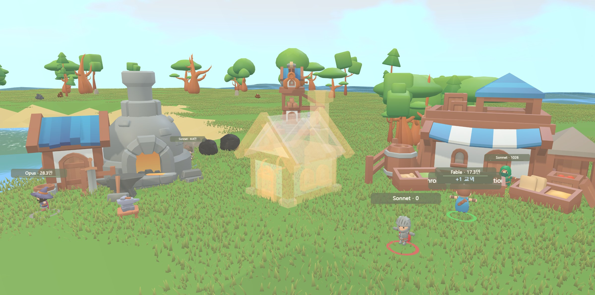

# agentview

Watch your AI agents work — a local dashboard that renders your Claude Code sessions as a living game village.



Every session is a worker. Reads, greps and bash runs become mining, logging and hauling. When an agent finishes its job, a building goes up. Workers wear their model name and generated-token count as a nameplate.

**Website:** https://sungeunstar.github.io/agentview/

## Quick start

```
npx github:sungeunstar/agentview
```

or

```
git clone https://github.com/sungeunstar/agentview
cd agentview
npm start
```

Opens at `http://localhost:4577`. Requires Node.js 18+ and [Claude Code](https://claude.com/claude-code).

On Windows you can also double-click `start-agentview.cmd` to keep it running in a minimized window.

## Options

| Option | What it does |
|---|---|
| `--port <n>` | Serve on a different port (default 4577) |
| `--claude-home <path>` | Claude data directory (default `~/.claude`, honors `CLAUDE_CONFIG_DIR`) |
| `--no-open` | Don't open the browser on start |

## How it works

- A single zero-dependency Node server tails the session transcripts Claude Code already writes to your disk (`~/.claude/projects`), plus background job state (`~/.claude/jobs`).
- Live sessions and background agents appear as villagers. Tool calls drive what they do; agent completion finishes the construction site.
- A token ledger indexes daily/weekly generated tokens per model, incrementally — first full scan runs in the background and recent days fill in within seconds.

## Privacy

Local-only by design. The server binds to `127.0.0.1`, makes no outbound requests, and has no accounts or telemetry. Your prompts and code never leave your machine.

Note: the transcript format is unofficial. agentview parses defensively — unknown lines are skipped, and the dashboard warns you if a Claude Code update changes the format.

## Platforms

Windows is tested. macOS and Linux are supported in code (path detection, browser open) — issue reports and PRs welcome.

## Credits

3D assets by [KayKit](https://kaylousberg.com/game-assets) and [Kenney](https://kenney.nl/).

## License

MIT
